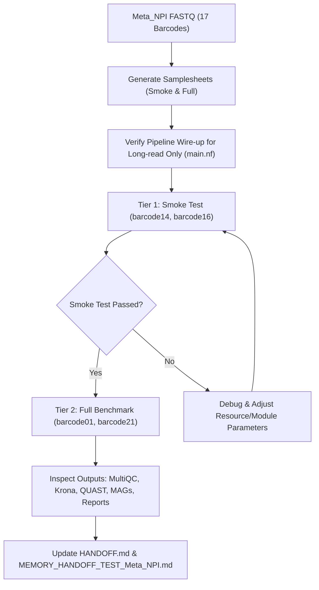

# PLAN_TEST_Meta_NPI.md — Comprehensive Test Plan for Dorado Nanopore Metagenomics Data

## 1. Overview & Objectives

This document defines the formal execution plan to validate and benchmark the **Hybrid Metagenomics Nextflow DSL2 Pipeline** using real-world Oxford Nanopore Technologies (ONT) long-read sequencing data located in the `Meta_NPI/` directory.

### Key Objectives:
1. **Nanopore-Only Pipeline Validation**: Verify end-to-end execution across all 11 workflow stages without Illumina short-read dependencies.
2. **Dorado SUP Read Compatibility**: Validate handling of modern high-accuracy Dorado SUP reads (`SQK-RBK114-24` kit, `dna_r10.4.1_e8.2_400bps_sup@v5.0.0`).
3. **Multi-tier Testing Strategy**:
   - **Tier 1 (Smoke Test)**: Lightweight subset of barcodes (`barcode14`, `barcode16`) for rapid verification of tools, Docker containers, and channels in < 5 minutes.
   - **Tier 2 (Deep Benchmark)**: High-yield barcodes (`barcode01`, `barcode20`, `barcode21`) for full metagenomic assembly (Flye), long-read mapping (Minimap2), MAG binning (MetaBAT2/SemiBin2), read-based classification (Kraken2/Krona), and report generation.

---

## 2. Dataset Characterization (`Meta_NPI`)

The dataset is located at `/home/surj/Workspace/metagenomics-pipeline/Meta_NPI/1_basecalled_fastq/`.

### Sequencing Metadata:
- **Basecaller**: Dorado (`dna_r10.4.1_e8.2_400bps_sup@v5.0.0`)
- **Chemistry & Kit**: ONT R10.4.1 Flowcell / SQK-RBK114-24 (Rapid Barcoding Kit 24)
- **Mean Quality Score**: ~Q17.6 (High accuracy SUP mode)
- **Barcodes Available**: 17 barcodes

### Barcode Volume & Stratification:

| Stratum | Barcodes | Read Count Range | Total Size | Testing Purpose |
|---|---|---|---|---|
| **Low Volume (Smoke Test)** | `barcode02`, `barcode09`, `barcode11`, `barcode12`, `barcode13`, `barcode14`, `barcode15`, `barcode16`, `barcode17` | 3 – 414 reads | ~1.3 MB | Ultra-fast channel checks, container liveness, CI smoke tests |
| **High Volume (Full Benchmark)** | `barcode01`, `barcode18`, `barcode19`, `barcode20`, `barcode21`, `barcode22`, `barcode23`, `barcode24` | 3,034 – 8,807 reads | ~247 MB | Full assembly graph resolution, contig coverage, MAG binning, Kraken2 profiling |

---

## 3. Pipeline Configuration & Parameter Setup

### Dedicated Config (`conf/meta_npi.config` / `params/meta_npi.yaml`):

```yaml
# Nanopore Dorado Metagenomic Profile
assembler: 'flye'
flye_mode: '--nano-hq'              # Optimized for Dorado SUP Q17+ reads
flye_extra_args: '--meta'           # Metagenome mode for uneven coverage

# Preprocessing & Trimming
run_basecalling: false              # FASTQs already basecalled by Dorado
run_porechop: false                 # Barcodes already demultiplexed by Dorado
run_filtlong: true                  # Quality/length filtering
min_quality_long: 10                # Minimum Q10 (Dorado SUP avg Q17+)
min_length_long: 500                # Filter fragments < 500bp

# Polishing
run_polishing: false                # Dorado SUP reads often do not require Racon iterations

# Mapping & Coverage
aligner: 'minimap2'

# Binning
min_contig_len_binning: 1000        # Adjusted for long-read contigs
run_metabat2: true
run_semibin2: true
semibin_environment: 'global'
run_maxbin2: false
run_concoct: false
run_dastool: false

# Read-Based Profiling
run_kraken2: true
run_krona: true
run_kraken_biom: true
run_bracken: false

# Reporting
run_prokka: true
run_multiqc: true
run_custom_report: true
```

---

## 4. Step-by-Step Implementation & Execution Plan



### Phase 1: Samplesheet Generation
- Create `samplesheet_meta_npi_smoke.csv`:
  - Contains `barcode14` (320 reads) and `barcode16` (414 reads).
- Create `samplesheet_meta_npi_full.csv`:
  - Contains all 17 barcodes or selected high-depth barcodes (`barcode01`, `barcode18`, `barcode20`, `barcode21`, `barcode23`).

### Phase 2: Pipeline Wiring Audit & Adjustments
- Verify `main.nf`:
  - Ensure `ch_clean_long` is routed to `assembly_free` workflow when short reads are absent (`ch_profiling_reads = ch_clean_short.mix(ch_clean_long)`).
  - Verify that `polishing` branch gracefully defaults to `ch_clean_long` when short reads are not present.

### Phase 3: Execution of Tier 1 (Smoke Test)
- Command:
  ```bash
  nextflow run main.nf \
      -profile docker,test \
      --input samplesheet_meta_npi_smoke.csv \
      --assembler flye \
      --flye_mode --nano-hq \
      --outdir results_meta_npi_smoke
  ```
- Acceptance Criteria:
  - NanoPlot runs and generates read statistics.
  - Filtlong filters reads without error.
  - Minimap2 host removal passes reads through.
  - Flye completes assembly.
  - QUAST generates contig statistics.
  - Mapping generates long-read BAM and depth table.
  - CAT_BINS consolidates bins/contigs.
  - MultiQC and custom HTML/MD report generated.

### Phase 4: Execution of Tier 2 (Full Benchmark Test)
- Command:
  ```bash
  nextflow run main.nf \
      -profile docker \
      -c conf/meta_npi.config \
      --input samplesheet_meta_npi_full.csv \
      --outdir results_meta_npi_benchmark
  ```

### Phase 5: Result Analysis & Verification
- Check QUAST report for N50, L50, and largest contig sizes.
- Inspect Krona interactive visualization (`*.krona.html`).
- Check MAG binning summary (`bins_summary.tsv`).
- Validate final HTML report (`results/reporting/pipeline_report.html`).

---

## 5. Risk Assessment & Mitigations

| Potential Risk | Likelihood | Impact | Mitigation Strategy |
|---|---|---|---|
| Low read count in some barcodes causes Flye assembly to fail | High (for barcodes < 100 reads) | Low | Stratify testing: Use `barcode14`+`barcode16` for smoke tests and `barcode01` (8.8k reads) for assembly benchmarks. |
| Kraken2 database memory limit in local Docker | Medium | Medium | Use `--kraken2_db test/data/tiny_databases/kraken2_db` for CI/local runs or full MiniKraken if memory allows. |
| Single-end read input in assembly-free workflow | Low | Low | Wire `main.nf` to pass `ch_clean_long` to `assembly_free`, which natively supports single-end reads in `KRAKEN2`. |
