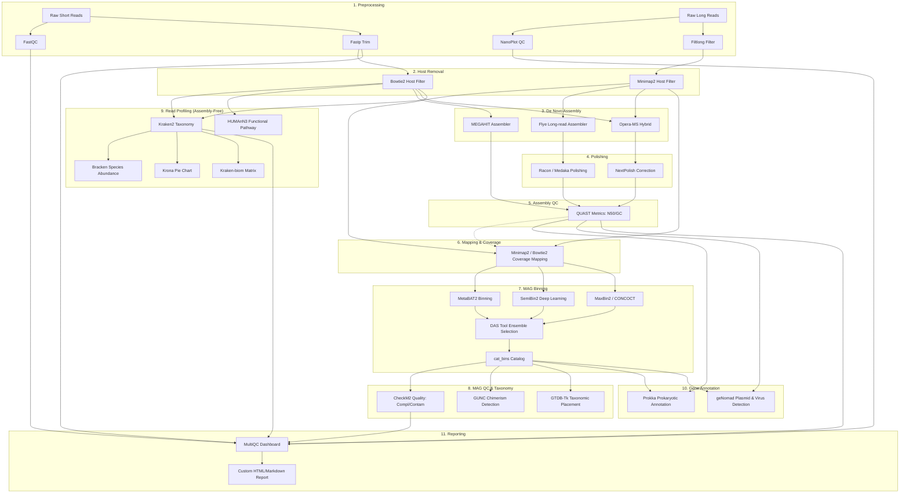

# 🧬 คู่มือการเรียนรู้โครงการ Hybrid Metagenomics Nextflow DSL2 Pipeline และเจาะลึก 35 เครื่องมือชีวสารสนเทศ
> **Comprehensive Guide & Beginner-Friendly Tutorial for Metagenomics Workflow Framework**  
> จัดทำขึ้นสำหรับการศึกษา, วิจัย, และการเรียนการสอนด้านชีวสารสนเทศศาสตร์ (Bioinformatics & Metagenomics)

---

## 📑 สารบัญ (Table of Contents)
1. [บทนำ: Metagenomics คืออะไร และทำไมต้องมี Pipeline นี้?](#1-บทนำ-metagenomics-คืออะไร-และทำไมต้องมี-pipeline-นี้)
2. [สถาปัตยกรรมซอฟต์แวร์ 5 ระดับ (5-Layer Architecture)](#2-สถาปัตยกรรมซอฟต์แวร์-5-ระดับ-5-layer-architecture)
3. [ภาพรวมของกระบวนการวิเคราะห์ทั้ง 11 ขั้นตอน (11 Workflow Stages)](#3-ภาพรวมของกระบวนการวิเคราะห์ทั้ง-11-ขั้นตอน-11-workflow-stages)
4. [เจาะลึก 35 เครื่องมือชีวสารสนเทศ (คู่มือการทำงาน, อัลกอริทึม, และวิธีแปลผล)](#4-เจาะลึก-35-เครื่องมือชีวสารสนเทศ)
   - [หมวดที่ 1: Preprocessing & Quality Control (7 เครื่องมือ)](#หมวดที่-1-preprocessing--quality-control)
   - [หมวดที่ 2: Host Removal & Decontamination (2 เครื่องมือ)](#หมวดที่-2-host-removal--decontamination)
   - [หมวดที่ 3: De Novo Assembly (3 เครื่องมือ)](#หมวดที่-3-de-novo-assembly)
   - [หมวดที่ 4: Polishing & Error Correction (3 เครื่องมือ)](#หมวดที่-4-polishing--error-correction)
   - [หมวดที่ 5: Assembly Quality Assessment (1 เครื่องมือ)](#หมวดที่-5-assembly-quality-assessment)
   - [หมวดที่ 6: Read Mapping & Coverage Profiling (3 เครื่องมือ)](#หมวดที่-6-read-mapping--coverage-profiling)
   - [หมวดที่ 7: MAG Binning & Refinement (6 เครื่องมือ)](#หมวดที่-7-mag-binning--refinement)
   - [หมวดที่ 8: MAG Quality Control & Taxonomy (3 เครื่องมือ)](#หมวดที่-8-mag-qc--taxonomy)
   - [หมวดที่ 9: Read-Based Profiling (Assembly-Free) (5 เครื่องมือ)](#หมวดที่-9-read-based-profiling-assembly-free)
   - [หมวดที่ 10: Functional & Mobile Element Annotation (2 เครื่องมือ)](#หมวดที่-10-functional--annotation)
   - [หมวดที่ 11: Reporting & Aggregation (2 เครื่องมือ)](#หมวดที่-11-reporting--aggregation)
5. [การเปรียบเทียบ 3 รูปแบบการวิเคราะห์ (Illumina vs Nanopore vs Hybrid)](#5-การเปรียบเทียบ-3-รูปแบบการวิเคราะห์)
6. [กรณีศึกษาตัวอย่างจริง: การประมวลผล ONT Meta_NPI Dataset (17 Barcodes)](#6-กรณีศึกษาตัวอย่างจริง-ont-meta_npi-dataset)
7. [พจนานุกรมคำศัพท์ชีวสารสนเทศที่พบบ่อย (Bioinformatics Glossary)](#7-พจนานุกรมคำศัพท์ชีวสารสนเทศที่พบบ่อย)

---

# 1. บทนำ: Metagenomics คืออะไร และทำไมต้องมี Pipeline นี้?

### 🔬 Metagenomics คืออะไร?
ในอดีต หากเราต้องการศึกษาสิ่งมีชีวิตขนาดเล็ก (แบคทีเรีย, ไวรัส, รา) ในตัวอย่างจากธรรมชาติ เช่น น้ำในแม่น้ำ ดิน หรือลำไส้มนุษย์ นักวิทยาศาสตร์ต้องนำตัวอย่างมา **เพาะเลี้ยงในจานเพาะเชื้อ (Culture)** เสียก่อน แต่ความจริงคือ **จุลินทรีย์มากกว่า 99% ในธรรมชาติ "ไม่สามารถเพาะเลี้ยงในห้องแล็บได้" (The Great Plate Count Anomaly)**

**Metagenomics (การศึกษาสารพันธุกรรมรวมของชุมชนจุลชีพ)** คือการสกัดสารพันธุกรรม (DNA/RNA) ทั้งหมดจากตัวอย่างสิ่งแวดล้อมโดยตรง **โดยไม่ต้องเพาะเชื้อ** แล้วนำไปถอดรหัสพันธุกรรม (Next-Generation Sequencing - NGS) เพื่อตอบคำถาม 3 ข้อหลัก:
1. **Who is there?** — มีจุลินทรีย์ชนิดใดบ้าง อยู่ในสัดส่วนเท่าไร (Taxonomic Profiling)
2. **What are they doing?** — จุลินทรีย์เหล่านั้นมียีนที่ทำหน้าที่อะไรบ้าง เช่น การย่อยสลายสารอาหาร, ยีนดื้อยา (AMR), หรือวิถีเมแทบอลิซึม (Functional Profiling)
3. **Can we reconstruct their genomes?** — เราสามารถนำชิ้นส่วน DNA เล็กๆ มาต่อกลับเป็นจีโนมที่สมบูรณ์ของสิ่งมีชีวิตแต่ละชนิดได้หรือไม่ (Metagenome-Assembled Genomes: MAGs)

```
ตัวอย่างจากธรรมชาติ (ดิน/น้ำ/ลำไส้)
       │
       ▼ [สกัด DNA รวม]
  DNA ผสมของสิ่งมีชีวิตนับร้อยนับพันชนิด
       │
       ▼ [เครื่องถอดรหัสพันธุกรรม: Illumina / Nanopore]
  Reads หลายล้านชิ้น (กระจัดกระจายปนกัน)
       │
       ▼ 🧬 Pipeline ของเราทำหน้าที่ตรงนี้! 🧬
  ต่อจีโนม (Assembly) ➔ จัดกลุ่มสายพันธุ์ (Binning) ➔ ระบุสปีชีส์ ➔ ทำนายยีน
```

### 🧩 ความท้าทายของเทคโนโลยี Sequencing
* **Short Reads (เช่น Illumina)**: อ่านได้สั้น (150–300 เบส) แต่มีความแม่นยำสูงมาก (>99.9%) ข้อเสียคือเวลาเจอส่วนที่ซ้ำกันของจีโนม (Repeats) จะต่อไม่ติด
* **Long Reads (เช่น Oxford Nanopore / PacBio)**: อ่านได้ยาวมาก (หลักหมื่นถึงหลักแสนเบส) ข้าม Repetitive regions ได้สบาย แต่เดิมมีความแม่นยำต่ำกว่า Short reads (แม้ปัจจุบัน Dorado SUP จะได้ความแม่นยำ >Q17-Q20 ก็ตาม)
* **Hybrid Approach**: นำความแม่นยำของ Short reads มารวมกับความยาวของ Long reads เพื่อสร้างจีโนมจุลินทรีย์ที่สมบูรณ์ที่สุด

**Pipeline ของเราสร้างขึ้นเพื่อรองรับทั้ง 3 สถานการณ์ (Short-only, Long-only, Hybrid) แบบอัตโนมัติ 100% ผ่าน Nextflow DSL2**

---

# 2. สถาปัตยกรรมซอฟต์แวร์ 5 ระดับ (5-Layer Architecture)

เพื่อไม่ให้โค้ดกลายเป็นสคริปต์สปาเกตตี (Spaghetti code) ที่บำรุงรักษายาก โครงการนี้ถูกออกแบบตามหลักสถาปัตยกรรมซอฟต์แวร์ 5 ชั้นอย่างเคร่งครัด:

```
┌─────────────────────────────────────────────────────────────┐
│ 1. Application Layer (main.nf)                              │
│    ทำหน้าที่เป็นผู้กำกับ (Director) สั่งรัน Workflow ย่อย   │
├─────────────────────────────────────────────────────────────┤
│ 2. Workflow Layer (workflows/*.nf)                          │
│    ร้อยเรียง Module ต่างๆ เข้าด้วยกันเป็นขั้นตอน (11 Stages) │
├─────────────────────────────────────────────────────────────┤
│ 3. Module Layer (modules/local/*/main.nf)                   │
│    1 Module = 1 Tool เท่านั้น รันผ่าน Container / Conda     │
├─────────────────────────────────────────────────────────────┤
│ 4. Script Layer (lib/*.groovy, bin/*.py)                    │
│    โค้ดผู้ช่วย (Helper) ตรวจสอบไฟล์, แปลงข้อมูล, สร้างรายงาน│
├─────────────────────────────────────────────────────────────┤
│ 5. Infrastructure Layer (conf/*.config, params/*.yaml)       │
│    กำหนดทรัพยากร (CPU/RAM), Containers, และพารามิเตอร์     │
└─────────────────────────────────────────────────────────────┘
```

### กฎเหล็กของ Layer Boundaries (Architecture Rules)
* `main.nf` ห้ามสั่งรันเครื่องมือหรือรัน Shell script โดยตรง ต้องเรียกผ่าน `workflows/`
* `workflows/*.nf` เชื่อมต่อ Channels และเรียกใช้ `modules/` เท่านั้น
* `modules/local/*/main.nf` ทำงานกับเครื่องมือเดียว (Single Responsibility Principle)
* ห้ามใส่ Hardcoded path ในไฟล์โค้ด — ทุกอย่างต้องส่งผ่าน `params.*`

---

# 3. ภาพรวมของกระบวนการวิเคราะห์ทั้ง 11 ขั้นตอน (11 Workflow Stages)



---

# 4. เจาะลึก 35 เครื่องมือชีวสารสนเทศ

---

## หมวดที่ 1: Preprocessing & Quality Control
> **เป้าหมาย**: ตรวจสอบคุณภาพลำดับเบส, ตัดส่วนที่เสียหาย, กำจัด Adapter, และคัดกรองเฉพาะลำดับเบสที่มีคุณภาพสูงก่อนนำไปวิเคราะห์ต่อ (Garbage in, Garbage out)

```
         ┌───────────────────┐
Raw Data │ FASTQ (Reads + Q) │
         └─────────┬─────────┘
                   ▼
  ┌─────────────────────────────────┐
  │ 1. ตรวจสอบคุณภาพ (FastQC/NanoPlot)│
  │ 2. ตัด Adapter/คัดทิ้ง (Fastp/Filt)│
  └────────────────┬────────────────┘
                   ▼
    ┌─────────────────────────────┐
    │ Clean & High-Quality Reads  │
    └─────────────────────────────┘
```

### 1. `FastQC` (Short Read Quality Control)
* **เปรียบเทียบให้เห็นภาพ**: เหมือนการส่งของเข้าห้องตรวจสภาพก่อนนำเข้าโรงงาน จะตรวจดูว่ามีของแตกหัก (เบสคุณภาพต่ำ) หรือมีเศษเทปกาวติดมาด้วยหรือไม่ (Adapter contamination)
* **ทำไมต้องใช้**: หากเราไม่ตรวจคุณภาพ Raw reads เราอาจนำข้อมูลที่มีข้อผิดพลาดในการอ่าน (Sequencing errors) ไปต่อจีโนม ทำให้ได้โครงสร้างพันธุกรรมที่ผิดเพี้ยน
* **หลักการทำงาน**: FastQC สแกนไฟล์ FASTQ ของ Short reads (เช่น Illumina) แล้วสร้างกราฟสถิติต่างๆ:
  1. *Per base sequence quality*: แสดงค่า Phred score ($Q$) ของแต่ละตำแหน่งตามความยาวอ่าน
  2. *Per sequence GC content*: ตรวจดูการกระจายตัวของค่า %GC ว่าเป็นกราฟระฆังคว่ำปกติหรือไม่ (ถ้ามีหลายยอด แปลว่าอาจมีการปนเปื้อนของสิ่งมีชีวิตชนิดอื่น)
  3. *Sequence Duplication Levels*: ตรวจวัดอัตราการเกิดชิ้นซ้ำจากการทำ PCR amplification
* **ไฟล์นำเข้า/ส่งออก**:
  * *Input*: ไฟล์ `.fastq.gz` (Short reads)
  * *Output*: รายงาน `.html` และไฟล์สถิติ `.zip`
* **วิธีแปลผล**: ดูกราฟ Per base sequence quality — โซนสีเขียวคือ $Q \ge 28$ (ดีเยี่ยม), สีเหลือง $20 \le Q < 28$ (ยอมรับได้), สีแดง $Q < 20$ (ควรตัดทิ้งด้วย Fastp)

---

### 2. `Fastp` (Ultra-fast Short Read Preprocessing)
* **เปรียบเทียบให้เห็นภาพ**: เหมือน "กรรไกรเลเซอร์อัตโนมัติ" ที่ตัดแต่งกิ่งไม้ส่วนที่เน่าเสียทิ้งไปอย่างรวดเร็ว
* **ทำไมต้องใช้**: Short reads มักจะมี Adapter ติดอยู่ที่ปลาย หรือมีเบสท้ายๆ ที่เครื่องอ่านได้ไม่ชัดเจน (Quality drop-off) ถ้าปล่อยไว้จะทำให้ขั้นตอน Assembly ล้มเหลว
* **หลักการทำงาน**: เขียนด้วยภาษา C++ รองรับ Multithreading ทำหน้าที่:
  1. *Auto-detect adapter*: ตรวจจับลำดับเบสของ Adapter อัตโนมัติโดยไม่ต้องใส่ลำดับเอง
  2. *Sliding-window quality filtering*: เลื่อนหน้าต่างขนาด 4 เบสไปตามสาย หากค่าเฉลี่ย $Q < 20$ จะตัดปลายทิ้ง
  3. *PolyG/PolyX trimming*: สำหรับเครื่อง Illumina NextSeq/NovaSeq ซึ่งใช้ 2-color chemistry หากไม่มีสัญญาณแสง เครื่องจะอ่านเป็นเบส G ทำให้เกิดหาง G ยาวๆ (PolyG tails) Fastp จะตรวจจับและตัดทิ้งอัตโนมัติ
* **ไฟล์นำเข้า/ส่งออก**:
  * *Input*: Raw paired-end FASTQ (`_1.fastq.gz`, `_2.fastq.gz`)
  * *Output*: Cleaned FASTQ (`_clean_1.fastq.gz`, `_clean_2.fastq.gz`), รายงาน `fastp.html`, `fastp.json`
* **วิธีแปลผล**: ตรวจดูค่า *Filtering result* ในไฟล์ HTML — สัดส่วน Reads passed filter ควรมากกว่า 85-90%

---

### 3. `NanoPlot` (Long Read Plotting & Quality Assessment)
* **เปรียบเทียบให้เห็นภาพ**: เหมือน "แผงหน้าปัดตรวจสุขภาพของ Nanopore Reads" ที่แสดงทั้งความยาวและการกระจายตัวของขนาดโมเลกุล
* **ทำไมต้องใช้**: Long reads มีความยาวตั้งแต่หลักร้อยเบสไปจนถึงหลักล้านเบส FastQC ทั่วไปไม่เหมาะกับ Long reads เพราะออกแบบมาสำหรับความยาวคงที่ (Fixed length)
* **หลักการทำงาน**: วิเคราะห์ไฟล์ FASTQ/BAM ของ Nanopore หรือ PacBio แล้วสร้างกราฟความสัมพันธ์ 2 มิติ (Bivariate plots) เช่น:
  1. กราฟความสัมพันธ์ระหว่าง *Read Length vs Average Read Quality*
  2. กราฟแสดงสถิติ *Read Length N50* (ความยาวที่ครึ่งหนึ่งของเบสทั้งหมดอยู่ใน Reads ที่ยาวกว่าหรือเท่ากับค่านี้)
  3. สถิติสะสม *Cumulative yield* (จำนวน Gigabases ที่ผลิตได้ตามเวลา)
* **ไฟล์นำเข้า/ส่งออก**:
  * *Input*: Long-read FASTQ/BAM
  * *Output*: กราฟ `.png`/`.html` เช่น `LengthvsQualityScatterPlot_dot.png`, รายงาน `NanoPlot-report.html`
* **วิธีแปลผล**: ดูค่า *Mean Read Quality* (สำหรับ Dorado SUP ควรอยู่ที่ Q15-Q20) และ *Median Read Length*

---

### 4. `Dorado Basecaller` (ONT Neural Network Basecalling)
* **เปรียบเทียบให้เห็นภาพ**: เหมือน "เครื่องแปลภาษา AI" ที่ฟังเสียงคลื่นไฟฟ้าของอะตอมแล้วแปลออกมาเป็นตัวอักษร DNA (A, C, G, T)
* **ทำไมต้องใช้**: เครื่อง Oxford Nanopore ไม่ได้อ่านเบสเป็นตัวอักษรโดยตรง แต่อ่านการเปลี่ยนแปลงของกระแสไฟฟ้า (Picoampere current) ในระดับเสี้ยววินาทีเมื่อ DNA ลอดผ่านรูโปรตีน (Nanopore)
* **หลักการทำงาน**: ใช้โมเดล Deep Learning (Connectionist Temporal Classification: CTC หรือ Conditional Random Fields: CRF) เช่น `dna_r10.4.1_e8.2_400bps_sup@v5.0.0`:
  1. รับสัญญาณกระแสไฟฟ้าดิบ (Raw signal) ในรูปแบบ POD5 หรือ FAST5
  2. คำนวณความน่าจะเป็นของเบสแต่ละตัวผ่าน Neural Network
  3. ปล่อยออกมาเป็นตัวอักษร A, T, C, G พร้อมค่า Phred Quality Score ($Q$-score)
* **ไฟล์นำเข้า/ส่งออก**:
  * *Input*: ไฟล์ Raw signal `.pod5` หรือ `.fast5`
  * *Output*: ไฟล์ `.fastq` หรือ Unaligned `.bam` ที่ระบุลำดับเบสและค่าความมั่นใจ (Base quality)
* **วิธีแปลผล**: โมเดล SUP (Super Accuracy) ให้ความแม่นยำสูงสุด (>98-99% raw read accuracy) เหมาะอย่างยิ่งสำหรับ Metagenomics

---

### 5. `Porechop-ABI` (Alignment-Based Nanopore Adapter Trimming)
* **เปรียบเทียบให้เห็นภาพ**: เหมือน "เครื่องสแกนบาร์โค้ดที่จุดคัดแยกพัสดุ" แล้วตัดป้ายพัสดุและเทปกาวหัวท้ายออก
* **ทำไมต้องใช้**: ในการทดลองที่นำหลายๆ ตัวอย่างมารวมกัน (Multiplexing) เช่น การใส่บาร์โค้ด 1 ถึง 24 ชิ้นส่วนบาร์โค้ดและอะแดปเตอร์จะยังติดอยู่กับหัว-ท้ายของสาย DNA หากไม่ตัดทิ้ง เครื่องมือ Assembly จะเข้าใจผิดว่าบาร์โค้ดเป็นส่วนหนึ่งของจีโนมสิ่งมีชีวิต
* **หลักการทำงาน**: พัฒนาต่อยอดจาก Porechop เดิม โดยใช้ระบบ **Alignment-Based Algorithm (ABI)**:
  1. นำชุดลำดับ Adapter/Barcode ทั้งหมดมาทำ Pairwise Sequence Alignment เทียบกับส่วนหัว (Start) และส่วนท้าย (End) ของ Read
  2. ระบุตำแหน่งรอยต่ออย่างแม่นยำ แม้ว่าเบสบริเวณอะแดปเตอร์จะมี Sequencing error สูง
  3. ตัดทิ้งหรือแยกโฟลเดอร์ตามบาร์โค้ด (Demultiplexing)
* **ไฟล์นำเข้า/ส่งออก**:
  * *Input*: Nanopore FASTQ
  * *Output*: Trimmed FASTQ (ที่ไม่มี Adapter ปนเปื้อน)
* **วิธีแปลผล**: ตรวจดูจำนวน Reads ที่ถูก Trim adapter ออกไป และความยาวเฉลี่ยหลังตัด

---

### 6. `Filtlong` (Quality & Length Filtering for Long Reads)
* **เปรียบเทียบให้เห็นภาพ**: เหมือน "ตะแกรงร่อนทอง" ที่คัดเอาเฉพาะก้อนทองขนาดใหญ่และเนื้อแน่น (Reads ที่ทั้งยาวและมีคุณภาพสูง) และร่อนเศษทรายทิ้งไป
* **ทำไมต้องใช้**: Long reads มี Reads สั้นๆ คุณภาพแย่ (เช่น <300 bp, Q<10) ปนอยู่เป็นจำนวนมาก การเก็บชิ้นส่วนแย่ๆ ไว้จะเพิ่มภาระคำนวณของ Assembler และอาจทำให้เกิด Contig ปลอม
* **หลักการทำงาน**: คำนวณน้ำหนักคะแนน (Score Weighting):
  $$\text{Score} = \text{Length} \times f(\text{Mean Quality})$$
  1. กรองทิ้ง Reads ที่ความยาวต่ำกว่าเกณฑ์ เช่น `--min_length 300` หรือ `1000`
  2. กรองทิ้ง Reads ที่คุณภาพเฉลี่ยต่ำกว่าเกณฑ์ เช่น `--min_mean_q 10`
  3. สามารถจำกัดขนาดผลผลิตรวม (เช่น เลือกเฉพาะหัวกะทิ 500 Megabases ที่ดีที่สุด)
* **ไฟล์นำเข้า/ส่งออก**:
  * *Input*: Long-read FASTQ
  * *Output*: Cleaned & Filtered Long-read FASTQ
* **วิธีแปลผล**: ในการรัน Nanopore ควรตั้ง `min_mean_q 10` เพื่อให้ได้เบสคุณภาพสูงพร้อมสำหรับ Flye Assembly

---

### 7. `MultiQC` (Aggregate Bioinformatics QC Dashboard)
* **เปรียบเทียบให้เห็นภาพ**: เหมือน "Executive Summary Dashboard" ที่รวบรวมรายงานผลจากทุกแผนกในบริษัทมาสรุปไว้ในหน้าเว็บเดียว
* **ทำไมต้องใช้**: ใน Pipeline มีเครื่องมือทำงานนับสิบตัวกับตัวอย่างหลายสิบ Barcode หากต้องเปิดไฟล์รายงานทีละอันจะต้องเปิดเป็นร้อยๆ ไฟล์
* **หลักการทำงาน**: สแกนหาโฟลเดอร์ผลลัพธ์ของ FastQC, Fastp, NanoPlot, Bowtie2, Minimap2, QUAST, Prokka, CheckM2 ฯลฯ ดึงค่าตัวเลขเชิงสถิติ (Log parsing) มารวมกันสร้างเป็นหน้า HTML ที่มีกราฟ Interactive สวยงาม
* **ไฟล์นำเข้า/ส่งออก**:
  * *Input*: ไดเรกทอรี Log files ของทุกโปรแกรม
  * *Output*: `multiqc_report.html`, `multiqc_data/`
* **วิธีแปลผล**: เปิดไฟล์ HTML ดูตาราง General Statistics เพื่อเปรียบเทียบคุณภาพของทุกตัวอย่างพร้อมกันในตารางเดียว

---

## หมวดที่ 2: Host Removal & Decontamination
> **เป้าหมาย**: กำจัด DNA ของสิ่งมีชีวิตเจ้าบ้าน (Host DNA เช่น มนุษย์, สัตว์ทดลอง, หรือพืช) ออกจากตัวอย่าง เพื่อให้เหลือเฉพาะ DNA ของจุลินทรีย์

```
 ตัวอย่างสิ่งส่งตรวจ (เช่น น้ำลาย/อุจจาระ/เนื้อเยื่อ)
        │
        ├─ DNA จุลินทรีย์ (Microbiome)  ➔ [สิ่งที่ต้องการ!]
        └─ DNA ของมนุษย์/เจ้าบ้าน (Host) ➔ [ต้องกำจัดทิ้ง!]
        │
   Align เทียบกับ Human Reference Genome (GRCh38)
        │
        ├─ Match กับ Host ➔ ทิ้งขยะ (Decontaminated)
        └─ Unmapped Reads ➔ ส่งต่อให้ Pipeline จุลินทรีย์ 🧬
```

### 8. `Bowtie2 (Host Removal)` (Short-Read Host Decontamination)
* **เปรียบเทียบให้เห็นภาพ**: เหมือน "ด่านตรวจคนเข้าเมืองความเร็วสูง" ที่คอยตรวจหนังสือเดินทางของ Short reads เทียบกับฐานข้อมูล Host ถ้าพบว่าเป็นของ Host จะถูกคัดแยกออกทันที
* **ทำไมต้องใช้**: ตัวอย่างทางการแพทย์ (เช่น เลือด, ชิ้นเนื้อ) มักมี DNA มนุษย์ปะปนอยู่สูงถึง 90-99% หากไม่คัดออก เราจะเสียเวลาประมวลผล Assembly ไปกับจีโนมมนุษย์แทนที่จะเป็นเชื้อโรค
* **หลักการทำงาน**: ใช้เทคนิค **Burrows-Wheeler Transform (BWT) และ FM-index**:
  1. บีบอัดจีโนมอ้างอิงของ Host (เช่น มนุษย์ GRCh38) ให้มีขนาดเล็กและค้นหาได้อย่างรวดเร็วในหน่วยความจำ RAM
  2. ทำ Alignment แบบ End-to-end หรือ Local alignment สำหรับ Short reads
  3. ดึงเฉพาะชิ้นที่ไม่ติดกับ Host (**Unmapped reads**) โดยใช้คำสั่งแฟล็กของ Samtools: `--un-conc-gz` (สำหรับ Paired-end)
* **ไฟล์นำเข้า/ส่งออก**:
  * *Input*: Cleaned Short reads FASTQ, Host reference index (`.bt2`)
  * *Output*: Host-depleted FASTQ (`_host_removed_1.fastq.gz`, `_host_removed_2.fastq.gz`), BAM log
* **วิธีแปลผล**: ตรวจดู Alignment rate — ถ้าตัวอย่างมาจากสิ่งแวดล้อมบริสุทธิ์ Alignment rate กับมนุษย์ควรต่ำมาก (<1%) แต่ถ้าเป็นตัวอย่างเนื้อเยื่อมนุษย์อาจสูงถึง 90%+

---

### 9. `Minimap2 (Host Removal)` (Long-Read Host Decontamination)
* **เปรียบเทียบให้เห็นภาพ**: เหมือน "สุนัขดมกลิ่นค้นหาสิ่งแปลกปลอม" ที่สามารถจับกลิ่นเฉพาะ (Minimizers) ของสาย DNA ขนาดยาวได้อย่างรวดเร็ว
* **ทำไมต้องใช้**: Bowtie2 ไม่เหมาะกับ Long reads เพราะ Long reads มีความยาวมากและมี Error rate แบบ InDel (Insertion/Deletion) สูงกว่า
* **หลักการทำงาน**: ใช้อัลกอริทึม **Seed-and-Extend ด้วย Minimizers**:
  1. *Minimizer seeding*: สแกนหา $k$-mer ที่มีค่าน้อยที่สุดในหน้าต่างขนาดย่อย ($w, k$) ทั่วจีโนมอ้างอิง
  2. *Chaining*: นำจุดยึด (Anchors) ที่ตรงกันมาร้อยเรียงเข้าด้วยกัน
  3. กรองเฉพาะ Long reads ที่ **Map ไม่ติดกับ Host** (`samtools fastq -f 4`) เพื่อส่งต่อไปขั้นตอนถัดไป
* **ไฟล์นำเข้า/ส่งออก**:
  * *Input*: Cleaned Long reads FASTQ, Host reference FASTA (`host_ref.fasta`)
  * *Output*: Clean Host-depleted Long-read FASTQ
* **วิธีแปลผล**: ตรวจสอบจำนวน Reads ที่เหลือรอด — Reads เหล่านี้คือสารพันธุกรรมของจุลินทรีย์แท้จริง

---

## หมวดที่ 3: De Novo Assembly
> **เป้าหมาย**: นำชิ้นส่วน Reads สั้น/ยาว หลายล้านชิ้นมาต่อเรียงกันเป็นสายยาวที่ต่อเนื่องกัน เรียกว่า **Contigs (Contiguous sequences)** โดยไม่ต้องอาศัยจีโนมอ้างอิง

```
Reads สั้นๆ นับล้านชิ้น:
  --[Read A]--
      --[Read B]--
          --[Read C]--
                --[Read D]--
                      │
                      ▼ [Assembler: SdBG / Repeat Graph]
Contig สายยาว (Contiguous Sequence):
  ====================[ Contig 1 (1.5 Mb) ]====================
```

### 10. `MEGAHIT` (Succinct de Bruijn Graph Assembler for Short Reads)
* **เปรียบเทียบให้เห็นภาพ**: เหมือนการต่อจิ๊กซอว์ 1 ล้านชิ้นที่มีภาพซ้ำๆ กัน โดยใช้เทคนิคการจำภาพแบบประหยัดแรมขั้นสุดยอด
* **ทำไมต้องใช้**: ข้อมูล Metagenomics จาก Short reads มีขนาดใหญ่มาก (หลายสิบ Gigabytes) แอสเซมเบลอร์ทั่วไปจะกิน RAM มหาศาลจนเครื่องค้าง (Out of Memory: OOM)
* **หลักการทำงาน**: ใช้ **Succinct de Bruijn Graph (SdBG)**:
  1. ตัด Reads ออกเป็นท่อนเล็กๆ ขนาด $k$ เบส เรียกว่า **$k$-mers**
  2. เริ่มต้นสร้างกราฟจาก $k$-mer ขนาดเล็ก (เช่น $k=21$) เพื่อจับชิ้นส่วนที่มี Depth ต่ำ (จุลินทรีย์ปริมาณน้อย)
  3. ค่อยๆ ปรับเพิ่มขนาด $k$ ขึ้นไปเรื่อยๆ ($k=29, 39, 59, ..., 141$) เพื่อแก้ปัญหาสายเบสที่ซ้ำซ้อน (Repeats)
  4. ยุบสายกราฟที่ไม่แตกแขนงออกมาเป็น Contigs
* **ไฟล์นำเข้า/ส่งออก**:
  * *Input*: Short reads FASTQ
  * *Output*: `final.contigs.fa`
* **วิธีแปลผล**: ได้ไฟล์ FASTA ของ Contigs สำหรับนำไปประเมินคุณภาพใน QUAST และทำ Binning ต่อไป

---

### 11. `Flye` (Repeat Graph Assembler for Long Reads)
* **เปรียบเทียบให้เห็นภาพ**: เหมือนการสร้างแผนที่เส้นทางรถไฟใต้ดิน โดยระบุจุดที่เป็นสถานีเชื่อมต่อขนาดใหญ่ (Repeats) ก่อน แล้วค่อยคลี่ขยายเส้นทางหลักออกมา
* **ทำไมต้องใช้**: Long reads สามารถอ่านข้ามท่อนที่ซ้ำซ้อน (Repeats) ได้ Flye ถูกออกแบบมาโดยเฉพาะเพื่อจัดการกับ Metagenome ที่มีเชื้อจุลินทรีย์หลากหลายชนิดและมีอัตราส่วนความลึก (Coverage depth) ที่แตกต่างกันอย่างมาก
* **หลักการทำงาน**: ใช้อัลกอริทึม **Repeat Graph**:
  1. สร้าง *Disjointigs* จากชิ้นส่วนที่ไม่มีความคลุมเครือ
  2. สร้าง *Repeat Graph* เพื่อระบุโครงสร้างการซ้ำและส่วนแยกของจีโนม
  3. คลี่ Repeat Graph เพื่อแก้ปัญหาวงวน (Resolving genomic repeats) โดยใช้ข้อมูลความยาวของ Long reads
  4. ในโหมด `--meta` จะปรับเกณฑ์การยอมรับ Contig ให้ยืดหยุ่นต่อสิ่งมีชีวิตที่มีความลึกตั้งแต่ $2\times$ ไปจนถึง $10,000\times$
* **ไฟล์นำเข้า/ส่งออก**:
  * *Input*: Long reads FASTQ
  * *Output*: `assembly.fasta`, `assembly_graph.gfa`, `assembly_info.txt`
* **วิธีแปลผล**: ในไฟล์ `assembly_info.txt` จะมีคอลัมน์บอกว่า Contig ใดมีโครงสร้างเป็นวงกลม (`circ. = Y`) ซึ่งแสดงถึง **Complete Circular Bacterial Chromosome หรือ Plasmid**!

---

### 12. `Opera-MS` (Hybrid Metagenomic Assembler)
* **เปรียบเทียบให้เห็นภาพ**: เหมือนการก่อสร้างตึก โดยใช้ "อิฐคุณภาพสูง" (Short-read contigs ที่แม่นยำ) วางเรียงกัน แล้วใช้ "คานเหล็กเส้นยาว" (Long reads) มาช่วยพาดเชื่อมโยงโครงสร้างทั้งหมดเข้าด้วยกัน
* **ทำไมต้องใช้**: การใช้ Short reads อย่างเดียวจะได้ Contig สั้นและแตกเป็นชิ้นเล็กชิ้นน้อย ส่วน Long reads อย่างเดียวอาจยังมี Error เล็กน้อย การทำ Hybrid Assembly จึงเป็นวิธีที่ดีที่สุดในการประกอบจีโนมระดับสมบูรณ์ (Closed Chromosomes)
* **หลักการทำงาน**:
  1. รับ Contigs จาก Short reads (เช่น จาก MEGAHIT)
  2. ใช้ Long reads มาทำ Alignment เพื่อหาจุดเชื่อมต่อ (Scaffolding / Bridging)
  3. คำนวณความน่าจะเป็นทางสถิติของ Metagenomic coverage เพื่อแยกแยะ Contig ของเชื้อคนละสปีชีส์ที่มียีนคล้ายกัน
  4. สร้างเป็น Scaffolds ขนาดใหญ่
* **ไฟล์นำเข้า/ส่งออก**:
  * *Input*: Short-read contigs + Long-read FASTQ + Short-read FASTQ
  * *Output*: `opera_ms_scaffolds.fasta`
* **วิธีแปลผล**: ช่วยเพิ่มค่า N50 ขึ้นหลายสิบเท่าเมื่อเทียบกับการใช้ Short reads เพียงอย่างเดียว

---

## หมวดที่ 4: Polishing & Error Correction
> **เป้าหมาย**: ปรับปรุงและแก้ไขข้อผิดพลาดของเบส (Base accuracy) บน Contigs ที่ได้จากการต่อ Long reads ให้มีความถูกต้องระดับ >99.99% (Q40+)

```
  Contig ดิบจาก Long Reads (อาจมี Indel error 0.5-1%):
  A T C G - - G T C A A T G C
      ▲ ▲     ▲
  นำ Reads ดิบมา Re-align & คำนวณ Consensus ใหม่:
  A T C G C C G T C A A T G C  ➔ (Polished Contig ความแม่นยำสูง)
```

### 13. `Racon` (Ultrafast Consensus Module via POA)
* **เปรียบเทียบให้เห็นภาพ**: เหมือนการให้กรรมการหลายๆ คนมาโหวตตรวจทานตัวสะกดในประโยค โดยสร้างแผนผังการโหวตแบบหลายมิติ
* **ทำไมต้องใช้**: Assembler ที่ต่อ Long reads มักจะมีข้อผิดพลาดประเภท InDel (เบสขาดหรือเกิน) หลงเหลืออยู่ Racon ช่วยขัดเกลาจีโนมให้เรียบเนียนขึ้นอย่างรวดเร็ว
* **หลักการทำงาน**: ใช้ **Partial Order Alignment (POA) Graph**:
  1. แมพ Reads กลับหา Contigs ด้วย Minimap2
  2. สร้างกราฟโครงสร้างแบบมีทิศทาง (DAG) สำหรับส่วนที่มีความแปรปรวน
  3. หาเส้นทางที่ผ่านเบสที่มีน้ำหนักการสนับสนุนจาก Reads สูงสุด (Heavy consensus path)
* **ไฟล์นำเข้า/ส่งออก**:
  * *Input*: Contigs FASTA, Reads FASTQ, Overlap PAF/SAM
  * *Output*: Polished FASTA
* **วิธีแปลผล**: ทำให้ลำดับเบสตรงตามจริง ลด Frameshift errors ในยีน

---

### 14. `Medaka` (Neural Network ONT Consensus Polishing)
* **เปรียบเทียบให้เห็นภาพ**: เหมือน "ครูตรวจข้อสอบผู้เชี่ยวชาญลายมือของ Nanopore" ที่รู้ว่าเครื่องซีเควนซ์ชอบเขียนตัวอักษรไหนผิดในบริบทใด
* **ทำไมต้องใช้**: Nanopore มีรูปแบบความคลาดเคลื่อนเฉพาะตัว (Systematic errors) เช่น บริเวณ Homopolymer (เบสซ้ำยาวๆ เช่น AAAAA) ซึ่งอัลกอริทึมทั่วไปแก้ยาก
* **หลักการทำงาน**: ใช้โมเดล **Recurrent Neural Network (Bi-directional LSTM)**:
  1. สร้างเมทริกซ์การนับเบส (Count matrix) จาก BAM alignment
  2. ป้อนเข้าโมเดล Neural network ที่เทรนมาเฉพาะกับรุ่น Pore และ Basecaller นั้นๆ (เช่น `r1041_e82_400bps_sup_v5.0.0`)
  3. ทำนายเบสที่ถูกต้องที่สุดในแต่ละตำแหน่ง
* **ไฟล์นำเข้า/ส่งออก**:
  * *Input*: Draft Contigs FASTA, Nanopore reads BAM
  * *Output*: `consensus.fasta`
* **วิธีแปลผล**: ช่วยฟื้นฟูโครงสร้าง Open Reading Frames (ORFs) ของยีนให้สมบูรณ์

---

### 15. `NextPolish` (Short-Read Error Correction on Long-Read Contigs)
* **เปรียบเทียบให้เห็นภาพ**: การใช้ "กล้องจุลทรรศน์ความละเอียดสูง" (Short reads แม่นยำ 99.99%) มาส่องแก้จุดบกพร่องเล็กๆ บน "โครงร่างบ้านขนาดใหญ่" (Long-read contigs)
* **ทำไมต้องใช้**: แม้ Long reads จะต่อได้ยาว แต่จุดที่มีเบสผิดพลาดประปรายจะทำให้การทำนายกรดอะมิโนผิดเพี้ยน การใช้ Short reads มา Polish จะทำให้ได้จีโนมที่ทั้งยาวและแม่นยำระดับสมบูรณ์แบบ
* **หลักการทำงาน**:
  1. แมพ Short reads คุณภาพสูงลงบน Contigs
  2. นับความถี่ของ $k$-mer และคะแนน Alignment
  3. แก้ไขจุดที่เป็น Single Nucleotide Polymorphisms (SNPs) และ Small InDels
* **ไฟล์นำเข้า/ส่งออก**:
  * *Input*: Long-read Contigs FASTA, Short-read FASTQ
  * *Output*: `polished.fasta`
* **วิธีแปลผล**: เพิ่มความแม่นยำของลำดับเบสสู่ระดับ Q50+ (ความผิดพลาดไม่เกิน 1 ใน 100,000 เบส)

---

## หมวดที่ 5: Assembly Quality Assessment
> **เป้าหมาย**: ประเมินความต่อเนื่อง (Continuity), ความยาวรวม, และคุณภาพของชิ้นส่วน Contigs หลังการประกอบจีโนม

### 16. `QUAST` (Quality Assessment Tool for Genome Assemblies)
* **เปรียบเทียบให้เห็นภาพ**: เหมือน "ใบรายงานผลการตรวจรับงานก่อสร้าง" ที่บอกว่าบ้านสร้างเสร็จกี่เปอร์เซ็นต์ มีเสาหลักกี่ต้น แต่ละต้นยาวเท่าไร มีรอยแตกร้าวตรงไหนบ้าง
* **ทำไมต้องใช้**: หากไม่มีเครื่องมือวัดผล เราจะไม่รู้เลยว่า Assembler ตัวไหนทำงานได้ดีกว่ากัน หรือพารามิเตอร์ที่ตั้งไว้ให้ผลลัพธ์ที่ดีหรือไม่
* **หลักการทำงาน**: คำนวณค่าสถิติด้านโครงสร้างจีโนมทั้งหมด:
  1. *N50*: ค่าความยาวของ Contig ณ จุดที่ผลรวมความยาวของ Contig ที่ยาวกว่านั้นสะสมได้ถึง 50% ของขนาดจีโนมรวม (ยิ่ง N50 สูง แปลว่าชิ้นงานยิ่งต่อได้ยาวต่อเนื่อง ไม่แตกเป็นชิ้นเล็กชิ้นน้อย)
  2. *L50*: จำนวน Contig ที่น้อยที่สุดที่รวมความยาวแล้วได้ 50% ของขนาดจีโนมรวม (ยิ่ง L50 ต่ำ ยิ่งดี)
  3. *Total length*: ความยาวเบสรวมทั้งหมดของทุก Contigs
  4. *GC (%)*: เปอร์เซ็นต์ของเบส Guanine และ Cytosine
  5. *Contigs $\ge 1000$ bp / $\ge 5000$ bp*: จำนวนชิ้นที่มีขนาดยาวพอที่จะนำไปใช้ทำ Binning
* **ไฟล์นำเข้า/ส่งออก**:
  * *Input*: Contigs FASTA (`assembly.fasta`)
  * *Output*: `report.html`, `report.tsv`, `report.pdf`
* **วิธีแปลผล**:
  * ในงาน Metagenomics: ค่า **N50 > 50,000 - 100,000 bp** ถือว่ายอดเยี่ยมมากสำหรับการประกอบจีโนม Long reads
  * ค่า Contigs count ยิ่งน้อยในขณะที่ Total length คงที่ แสดงว่าจีโนมไม่แตกกระจาย

---

## หมวดที่ 6: Read Mapping & Coverage Profiling
> **เป้าหมาย**: นำ Reads ทั้งหมดกลับมาทาบเทียบ (Align/Map) ลงบน Contigs เพื่อคำนวณว่าแต่ละท่อนมีความลึกของการอ่าน (Depth/Coverage) เท่าไร ซึ่งเป็นข้อมูลสำคัญที่สุดในการแยกแยะสปีชีส์ในขั้นตอน Binning

```
  Contig 1: =======================================
  Reads:      ----   ----     ------     ----
              ------   ----      -----     ----
  Coverage:   [ เฉลี่ย 25x ตลอดสาย ➔ ส่งสัญญาณว่ามาจากแบคทีเรีย A ]

  Contig 2: =======================================
  Reads:      -------------------------------------
              -------------------------------------
              -------------------------------------
  Coverage:   [ เฉลี่ย 180x ตลอดสาย ➔ ส่งสัญญาณว่ามาจากแบคทีเรีย B ]
```

### 17. `map_short_reads` (Bowtie2 & Samtools BAM Pipeline)
* **เปรียบเทียบให้เห็นภาพ**: การวางทับกระเบื้องแผ่นเล็กๆ (Short reads) ลงบนพิมพ์เขียว (Contigs) แล้วบันทึกพิกัดตำแหน่งอย่างละเอียด
* **ทำไมต้องใช้**: เพื่อแปลงไฟล์ FASTQ ให้อยู่ในรูป Binary Alignment Map (BAM) ที่เรียงลำดับพิกัด (Sorted) และทำดัชนี (Indexed) พร้อมให้โปรแกรมอื่นดึงข้อมูล Coverage
* **หลักการทำงาน**:
  1. สร้าง Bowtie2 Index จาก Contigs FASTA
  2. รัน Alignment ด้วย Bowtie2 แบบ End-to-end
  3. ส่งผลลัพธ์ผ่าน Unix Pipe เข้าสู่ `samtools view -bS` เพื่อบีบอัดเป็น Binary BAM
  4. ใช้ `samtools sort` เรียงลำดับตามพิกัดโครโมโซม และ `samtools index` สร้างไฟล์ `.bai`
* **ไฟล์นำเข้า/ส่งออก**:
  * *Input*: Contigs FASTA, Short reads FASTQ
  * *Output*: Sorted BAM (`.bam`), Index (`.bam.bai`)
* **วิธีแปลผล**: ใช้ตรวจสอบ Mapping rate ว่ามีสัดส่วนของ Reads กี่เปอร์เซ็นต์ที่ต่อเข้าไปอยู่ใน Contigs ได้

---

### 18. `map_long_reads` (Minimap2 & Samtools BAM Pipeline)
* **เปรียบเทียบให้เห็นภาพ**: การทาบแถบไม้ยาว (Long reads) ลงบนแบบแปลน โดยยอมรับรอยหยักและความคลาดเคลื่อนเล็กน้อยได้
* **ทำไมต้องใช้**: คำนวณความลึก (Depth) และพิกัดของ Long reads บน Contigs
* **หลักการทำงาน**:
  1. ใช้ Minimap2 ด้วยพรีเซ็ต `-ax map-ont` สำหรับ Nanopore หรือ `-ax map-pb` สำหรับ PacBio
  2. จัดเก็บข้อมูล CIGAR string เพื่อแสดงตำแหน่งการ Match, Mismatch, Insertion, และ Deletion
  3. บีบอัด เรียงลำดับ และสร้าง Index BAM ผ่าน Samtools
* **ไฟล์นำเข้า/ส่งออก**:
  * *Input*: Contigs FASTA, Long reads FASTQ
  * *Output*: Sorted BAM (`.bam`), Index (`.bam.bai`)
* **วิธีแปลผล**: ได้ไฟล์ BAM มาตรฐานสำหรับนำไปคำนวณ Depth table ในขั้นตอนถัดไป

---

### 19. `align_reads_to_contigs` (Coverage Depth Calculation)
* **เปรียบเทียบให้เห็นภาพ**: เหมือนการทำ "ตารางบัญชีสรุปความหนาแน่น" ว่าถนนแต่ละเส้น (Contig) มีรถวิ่งผ่านกี่คันต่อตารางกิโลเมตร
* **ทำไมต้องใช้**: โปรแกรม Binning (เช่น MetaBAT2) ต้องการตารางสรุปค่าเฉลี่ยความลึกและความแปรปรวน (Mean coverage & Variance) ของแต่ละ Contig ในทุกตัวอย่าง
* **หลักการทำงาน**: ใช้สคริปต์ `jgi_summarize_bam_contig_depths` จาก MetaBAT:
  1. อ่านไฟล์ BAM ทั้งหมดพร้อมกัน
  2. คำนวณหาค่า Mean depth และ Variance ของความลึกตลอดความยาวของแต่ละ Contig
  3. สร้างตาราง Matrix ที่มีมิติเป็น (จำนวน Contigs $\times$ จำนวนตัวอย่าง)
* **ไฟล์นำเข้า/ส่งออก**:
  * *Input*: Sorted BAM files (`.bam`)
  * *Output*: `depth.txt` (ตาราง Depth/Coverage)
* **วิธีแปลผล**: Contigs ที่มาจากสิ่งมีชีวิตตัวเดียวกันจะมีรูปแบบความลึก (Coverage profile) ขึ้นลงสัมพันธ์กันข้ามตัวอย่างต่างๆ

---

## หมวดที่ 7: MAG Binning & Refinement
> **เป้าหมาย**: จัดกลุ่ม (Binning) ชิ้นส่วน Contigs หลายพันชิ้นให้แยกออกเป็นกลุ่มๆ โดยแต่ละกลุ่มคือ **1 จีโนมของสิ่งมีชีวิต 1 ชนิด (Metagenome-Assembled Genome: MAG)**

```
  Contigs นับหมื่นชิ้นที่ปะปนกันอยู่ในหลอดทดลอง:
  [Contig A1] [Contig B1] [Contig A2] [Contig C1] [Contig B2] [Contig A3]
                             │
     ┌───────────────────────┴───────────────────────┐
     ▼ 1. Tetranucleotide Frequency (ลายนิ้วมือ 4 เบส)  ▼ 2. Coverage Covariation
  ╔══════════════════════╗ ╔══════════════════════╗ ╔══════════════════════╗
  ║    MAG Bin 1 (สปีชีส์ A)║ ║    MAG Bin 2 (สปีชีส์ B)║ ║    MAG Bin 3 (สปีชีส์ C)║
  ║ [Contig A1, A2, A3]  ║ ║   [Contig B1, B2]    ║ ║       [Contig C1]    ║
  ╚══════════════════════╝ ╚══════════════════════╝ ╚══════════════════════╝
```

### 20. `MetaBAT2` (Metagenome Binning based on TNF & Coverage)
* **เปรียบเทียบให้เห็นภาพ**: เหมือนการแยกชิ้นส่วนของเล่นที่ปนกัน โดยดูทั้ง "ลวดลายของพลาสติก" (Tetranucleotide frequency) และ "สีของชิ้นส่วน" (Coverage depth)
* **ทำไมต้องใช้**: เป็นมาตรฐานระดับทองคำ (Gold Standard) ในวงการ Metagenomics มีความเร็วสูงและให้ผลลัพธ์ที่แม่นยำมาก
* **หลักการทำงาน**:
  1. คำนวณ **Tetranucleotide Frequency (TNF)**: นับความถี่ของคำความยาว 4 เบส (เช่น ATCG, GCTA ทั้งหมด 136 รูปแบบ) ซึ่งเปรียบเหมือน "ลายนิ้วมือทางชีววิทยา" เฉพาะตัวของแบคทีเรียแต่ละสายพันธุ์
  2. รวมระยะห่างทางสถิติของ TNF เข้ากับระยะห่างของ Coverage Depth
  3. ใช้เทคนิค Adaptive Graph-based Clustering จัดกลุ่ม Contigs ที่มีความคล้ายคลึงกันเข้าเป็น Bin
* **ไฟล์นำเข้า/ส่งออก**:
  * *Input*: Contigs FASTA, `depth.txt`
  * *Output*: โฟลเดอร์ของไฟล์ FASTA แต่ละ Bin (`bin.1.fa`, `bin.2.fa`, ...)
* **วิธีแปลผล**: แต่ละไฟล์ `.fa` ในโฟลเดอร์คือตัวแทนจีโนม 1 ตัวของจุลินทรีย์

---

### 21. `MaxBin2` (Expectation-Maximization Binning Algorithm)
* **เปรียบเทียบให้เห็นภาพ**: เหมือนการส่งนักสืบไปหา "หัวหน้ากลุ่ม" (Marker genes 107 ยีนสากล) ก่อน แล้วค่อยกวาดต้อนลูกน้อง (Contigs อื่นๆ) เข้ากลุ่มตามความน่าจะเป็น
* **ทำไมต้องใช้**: ทำงานได้ดีมากในตัวอย่างที่มีสายพันธุ์ซับซ้อน และใช้อัลกอริทึมคนละแบบกับ MetaBAT2
* **หลักการทำงาน**:
  1. สแกนหา Single-copy marker genes (107 ยีนที่พบในแบคทีเรียเกือบทุกชนิด) บน Contigs เพื่อประเมินว่าในตัวอย่างนี้น่าจะมีแบคทีเรียอยู่กี่สปีชีส์ (กำหนดค่า $K$ clusters เริ่มต้น)
  2. ใช้ **Expectation-Maximization (EM) Algorithm** ปรับปรุงความน่าจะเป็นที่ Contig แต่ละชิ้นจะสังกัดในแต่ละ Cluster ตามค่า TNF และ Coverage
* **ไฟล์นำเข้า/ส่งออก**:
  * *Input*: Contigs FASTA, Abundance/Coverage file
  * *Output*: `*.fasta` bins, `*.summary`
* **วิธีแปลผล**: ช่วยเก็บตก Bins ที่ MetaBAT2 อาจมองข้ามไป

---

### 22. `SemiBin2` (Deep Contrastive Learning for Metagenomic Binning)
* **เปรียบเทียบให้เห็นภาพ**: เหมือนการใช้ "ปัญญาประดิษฐ์ Deep Learning" ที่ฝึกดูภาพถ่ายดาวเทียมหลายมิติ เพื่อจัดหมวดหมู่กลุ่มประชากรจุลินทรีย์ที่สายพันธุ์ใกล้ชิดกันมากๆ
* **ทำไมต้องใช้**: วิธีดั้งเดิมมักแยกแบคทีเรียสายพันธุ์ใกล้เคียงกัน (Strain-level) ไม่ออก SemiBin2 ใช้ Deep Learning เพื่อแยกความแตกต่างระดับละเอียด
* **หลักการทำงาน**:
  1. ใช้ **Siamese Neural Network** และเทคนิค **Self-supervised Contrastive Learning**
  2. สร้างคู่อ้างอิง (Positive/Negative pairs) จากชิ้นส่วนที่แตกย่อยของ Contigs
  3. เรียนรู้ความสัมพันธ์เชิงลึกที่ซ่อนอยู่ระหว่าง TNF, K-mer embeddings, และ Coverage profiles
  4. มีพรีเซ็ตโมเดลเฉพาะสำหรับสภาพแวดล้อมต่างๆ เช่น `human_gut`, `ocean`, `soil`, หรือ `global`
* **ไฟล์นำเข้า/ส่งออก**:
  * *Input*: Contigs FASTA, BAM alignment
  * *Output*: Bins FASTA, Deep learning embedding matrix
* **วิธีแปลผล**: ได้ MAGs ที่มีค่า Contamination ต่ำและเก็บส่วนยากๆ ของจีโนมได้ดีขึ้น

---

### 23. `CONCOCT` (Clustering Contigs on Coverage and Composition)
* **เปรียบเทียบให้เห็นภาพ**: เหมือนการวาดเมฆหมอกความน่าจะเป็นแบบหลายมิติ (Gaussian Distribution) ครอบคลุมกลุ่มข้อมูล
* **ทำไมต้องใช้**: โดดเด่นเป็นพิเศษเมื่อเรามีข้อมูลตัวอย่างหลายๆ แหล่ง (Multi-sample / Time-series data)
* **หลักการทำงาน**:
  1. ตัดแบ่ง Contig ขนาดยาวออกเป็นท่อนย่อย (เช่น 10,000 bp)
  2. แปลงข้อมูล Sequence composition และ Multi-sample coverage ให้เป็นมิติทางคณิตศาสตร์ด้วย Principal Component Analysis (PCA)
  3. ใช้โมเดลทางสถิติ **Gaussian Mixture Models (GMM)** ร่วมกับ Variational Bayesian Inference เพื่อหาจุดศูนย์กลางของแต่ละ Cluster
* **ไฟล์นำเข้า/ส่งออก**:
  * *Input*: Contigs FASTA, Coverage table
  * *Output*: Clustering CSV (`concoct_clustering.csv`), Bins FASTA
* **วิธีแปลผล**: เหมาะสำหรับชุดข้อมูลที่มีหลาย Sample เพื่ออาศัยความแปรปรวนของ Coverage ช่วยแยกสปีชีส์

---

### 24. `DAS Tool` (Dereplication, Aggregation, and Scoring for MAGs)
* **เปรียบเทียบให้เห็นภาพ**: เหมือน "คณะกรรมการผู้ทรงคุณวุฒิ" ที่นำผลการจัดกลุ่มจาก 4 สำนัก (MetaBAT2, MaxBin2, SemiBin2, CONCOCT) มาเปรียบเทียบกัน แล้วเลือกส่วนที่ดีที่สุดของแต่ละสำนักมารวมเป็นชุดผลลัพธ์ชนะเลิศเพียงชุดเดียว
* **ทำไมต้องใช้**: ไม่มีโปรแกรม Binning ตัวใดที่ดีที่สุดสำหรับทุกสปีชีส์ บางตัวเก่งเชื้อกลุ่มหนึ่ง บางตัวเก่งอีกกลุ่มหนึ่ง การใช้ DAS Tool (Ensemble approach) จะทำให้ได้จำนวน High-quality MAGs เพิ่มขึ้น 20-50%!
* **หลักการทำงาน**:
  1. สแกนหา Single-Copy Genes (SCG) ของแบคทีเรียและอาร์เคียในทุก Bins จากทุกโปรแกรม
  2. คำนวณคะแนนคุณภาพ (Scoring Function):
     $$\text{Score} = \text{Completeness} - (c \times \text{Contamination})$$
  3. รวมชิ้นส่วน Contigs จากโปรแกรมที่ได้คะแนนสูงสุด และตัดชิ้นส่วนที่ซ้ำซ้อนทิ้ง (Dereplication & Aggregation)
* **ไฟล์นำเข้า/ส่งออก**:
  * *Input*: Bins จาก MetaBAT2, MaxBin2, SemiBin2, CONCOCT
  * *Output*: `*_DASTool_bins/`, `*_DASTool_summary.tsv`
* **วิธีแปลผล**: ตาราง Summary จะระบุคะแนน Score ของแต่ละ Bin — เลือกเฉพาะ Bins ที่ผ่านเกณฑ์ Score > 0.5

---

### 25. `cat_bins` (Bin Cataloging & Formatting Module)
* **เปรียบเทียบให้เห็นภาพ**: เหมือน "เจ้าหน้าที่ฝ่ายจัดเก็บเอกสาร" ที่นำแฟ้มงานที่ผ่านการคัดเลือกแล้วมาติดป้ายชื่อมาตรฐาน รวบรวมสถิติ และจัดหมวดหมู่ให้เป็นระเบียบ
* **ทำไมต้องใช้**: ผลลัพธ์ Bins จากหลายโปรแกรมอาจมีโครงสร้างโฟลเดอร์หรือชื่อไฟล์ที่ไม่เป็นมาตรฐาน Module นี้ทำหน้าที่รวมและจัดรูปแบบให้พร้อมส่งเข้าสู่ CheckM2 และ GTDB-Tk
* **หลักการทำงาน**: รวบรวมไฟล์ `.fa`/`.fasta` ทั้งหมด คำนวณค่า Checksum และสร้างตารางสรุปรายชื่อ Bin ทั้งหมดในระบบ
* **ไฟล์นำเข้า/ส่งออก**:
  * *Input*: โฟลเดอร์ Bins FASTA
  * *Output*: Catalog directory, `bins_manifest.tsv`
* **วิธีแปลผล**: ทำให้มั่นใจได้ว่าไม่มีไฟล์ Bin ตกหล่นก่อนเข้าสู่ขั้นตอน QC

---

## หมวดที่ 8: MAG QC & Taxonomy
> **เป้าหมาย**: ตรวจสอบคุณภาพความสมบูรณ์ (Completeness) และการปนเปื้อน (Contamination) ของ MAGs พร้อมทั้งระบุชื่อสายพันธุ์ทางอนุกรมวิธาน (Taxonomic Classification)

```
  MAG Bin (ชิ้นส่วน Contigs รวมกัน):
  =============================================================
     │
     ├─ ตรวจหา 120 Marker Genes ➔ พบ 114 ยีน (Completeness = 95.0% ✅)
     ├─ ตรวจพบยีนซ้ำซ้อนข้ามสายพันธุ์ ➔ มี 2 ยีน (Contamination = 1.6% ✅)
     └─ ตรวจสอบการปนเปื้อน Chimerism ➔ GUNC Pass ✅
     │
     ▼ เข้าเกณฑ์ MIMAGS High-Quality Draft! 🏆
     ▼ ระบุชื่อสปีชีส์ด้วย GTDB-Tk: "Bacteroides uniformis"
```

### 26. `CheckM2` (Machine Learning-based MAG Quality Assessment)
* **เปรียบเทียบให้เห็นภาพ**: เหมือน "ระบบ AI ผู้เชี่ยวชาญด้านกายวิภาคของจุลินทรีย์" ที่ตรวจดูว่าอวัยวะสำคัญ (ยีนจำเป็นสากล) มีครบถ้วนหรือไม่ และมีอวัยวะของสิ่งมีชีวิตอื่นปนเข้ามาหรือไม่
* **ทำไมต้องใช้**: เป็นมาตรฐานสากลในการบอกว่า MAG ที่เราประกอบขึ้นมาได้นั้น "ดีพอที่จะตีพิมพ์หรือนำไปใช้งานหรือไม่"
* **หลักการทำงาน**: พัฒนาขึ้นมาแทน CheckM1 โดยเปลี่ยนจากการใช้ Lineage-specific marker trees แบบเดิม มาใช้ **Machine Learning (Gradient Boosted Trees / Neural Networks)**:
  1. สแกนหายีนทั้งหมดใน Bin และแปลงเป็น Feature vectors
  2. ทำนายค่า **Completeness (%)**: ความสมบูรณ์ของจีโนม (ควร $>90\%$)
  3. ทำนายค่า **Contamination (%)**: การปนเปื้อนของเบสหรือยีนจากสปีชีส์อื่น (ควร $<5\%$)
* **ไฟล์นำเข้า/ส่งออก**:
  * *Input*: Bins FASTA
  * *Output*: `quality_report.tsv`
* **วิธีแปลผล**:
  * **High-Quality MAG**: Completeness $> 90\%$ และ Contamination $< 5\%$
  * **Medium-Quality MAG**: Completeness $\ge 50\%$ และ Contamination $< 10\%$
  * **Low-Quality**: Completeness $< 50\%$ (ไม่ควรนำไปวิเคราะห์เชิงลึก)

---

### 27. `GUNC` (Genome UNClutterer — Chimerism & Contamination Detection)
* **เปรียบเทียบให้เห็นภาพ**: เหมือน "เครื่องตรวจจับภาพตัดต่อ" ที่คอยดูว่า Contigs ใน Bin เกิดจากการนำเอาชิ้นส่วนของแบคทีเรียคนละไฟลัม (Phylum) หรือคนละคลาสมามัดรวมกันแบบผิดๆ หรือไม่
* **ทำไมต้องใช้**: บางครั้ง CheckM2 อาจตรวจไม่พบการปนเปื้อน หากแบคทีเรียสองชนิดที่ถูกนำมารวมกันนั้นขาดยีนส่วนใหญ่ทั้งคู่ GUNC ถูกออกแบบมาเพื่อตรวจจับ Chimeric Bins โดยเฉพาะ
* **หลักการทำงาน**:
  1. ทำนายยีนบน Contigs และเทียบกับฐานข้อมูล Gene lineage
  2. คำนวณค่า **Clade Separation Score (CSS)**: วัดการกระจายตัวของเชื้อสายทางพันธุกรรมภายใน Bin เดียวกัน
  3. ประเมินว่าค่า Contamination เกิดจากเชื้อสายพันธุ์ใกล้เคียงกัน หรือเกิดจากสิ่งมีชีวิตคนละขั้วมาปนกัน
* **ไฟล์นำเข้า/ส่งออก**:
  * *Input*: Bins FASTA, GUNC Database
  * *Output*: `gunc_output/`, `GUNC.progenomes_2.1.maxCSS_level.tsv`
* **วิธีแปลผล**: ดูคอลัมน์ `pass.GUNC` — หากเป็น `TRUE` แสดงว่า Bin นั้นสะอาด ปราศจาก Chimerism ข้ามไฟลัม

---

### 28. `GTDB-Tk` (Genome Taxonomy Database Toolkit)
* **เปรียบเทียบให้เห็นภาพ**: เหมือน "สมุดทะเบียนราษฎร์สากลของจุลินทรีย์โลก" ที่จัดหมวดหมู่และตั้งชื่อวิทยาศาสตร์อย่างถูกต้องตามวิวัฒนาการ
* **ทำไมต้องใช้**: ฐานข้อมูล NCBI ดั้งเดิมมีชื่อสปีชีส์ที่ซ้ำซ้อนและจัดหมวดหมู่ผิดพลาดจำนวนมาก GTDB (Genome Taxonomy Database) เป็นมาตรฐานใหม่ของโลกที่ใช้ข้อมูลจีโนมทั้งจีโนมในการจัดหมวดหมู่
* **หลักการทำงาน**:
  1. *Identify*: ระบุตำแหน่งของ 120 Bacterial marker genes หรือ 53 Archaeal marker genes
  2. *Align*: นำยีนที่พบมาต่อเรียงกันเป็นสายยาว (Multiple Sequence Alignment)
  3. *Classify*: วางตำแหน่งของ MAG ลงบนต้นไม้สายสัมพันธ์ทางวิวัฒนาการอ้างอิง (Reference Phylogenetic Tree) และคำนวณค่า **Average Nucleotide Identity (ANI)** เทียบกับ Type species
* **ไฟล์นำเข้า/ส่งออก**:
  * *Input*: Cleaned MAGs FASTA
  * *Output*: `gtdbtk.bac120.summary.tsv`, `gtdbtk.ar53.summary.tsv`
* **วิธีแปลผล**: อ่านสาย Taxonomy เต็ม เช่น `d__Bacteria;p__Bacteroidota;c__Bacteroidia;o__Bacteroidales;f__Bacteroidaceae;g__Bacteroides;s__Bacteroides uniformis`

---

## หมวดที่ 9: Read-Based Profiling (Assembly-Free)
> **เป้าหมาย**: จำแนกชนิดและสัดส่วนของจุลินทรีย์ รวมถึงหน้าที่ทางชีวเคมี โดยตรงจาก Raw reads โดยไม่ต้องรอการต่อจีโนม (Assembly-Free) ทำให้ตรวจพบจุลินทรีย์ที่มีปริมาณน้อยๆ (Low abundance) ได้ดีมาก

```
 Raw Read:  A T C G G C T A A T C G G T C A ...
                  │
                  ▼ [ตัดเป็นท่อน k-mer: ATCGG, TCGGC, CGGCT...]
   ┌──────────────────────────────────────────────┐
   │ ค้นหาใน Hash Database (Kraken2 LCA Tree)    │
   └──────────────────────┬───────────────────────┘
                          ▼
            Taxon: Escherichia coli (TaxID: 562)
                          │
       ┌──────────────────┴──────────────────┐
       ▼ [Bracken: ปรับสัดส่วนสถิติ]              ▼ [Krona: วาดกราฟวงกลม]
  E. coli: 45.2%                           Interactive Pie Chart 🥮
  B. fragilis: 32.1%
```

### 29. `Kraken2` (Ultrafast Exact K-mer Taxonomic Classifier)
* **เปรียบเทียบให้เห็นภาพ**: เหมือน "เครื่องสแกนบาร์โค้ดสินค้าในห้าง" ที่ยิงสแกนแถบเบสสั้นๆ ปุ๊บ ก็รู้ทันทีว่าเป็นสิ่งมีชีวิตชนิดใดในเสี้ยววินาที
* **ทำไมต้องใช้**: เป็นเครื่องมือระบุสปีชีส์ที่เร็วที่สุดในโลก สามารถวิเคราะห์ข้อมูลหลายสิบล้าน Reads เสร็จสิ้นภายในเวลาไม่กี่นาที
* **หลักการทำงาน**: ใช้ **Compact Hash Table และ Lowest Common Ancestor (LCA)**:
  1. ตัด Read ออกเป็นคำย่อยขนาด $k$-mer (เช่น $k=35$)
  2. นำแต่ละ $k$-mer ไปค้นหาใน Compact Hash Database เพื่อดูว่า $k$-mer นั้นจำเพาะกับสิ่งมีชีวิตใด
  3. หาก $k$-mer นั้นพบในสิ่งมีชีวิตหลายชนิด โปรแกรมจะยกประโยชน์ให้บรรพบุรุษร่วมลำดับต่ำสุด (LCA)
  4. ตัดสินผลสรุปของ Read นั้นตามเส้นทางที่มีคะแนนโหวตสูงสุดใน Taxonomy Tree
* **ไฟล์นำเข้า/ส่งออก**:
  * *Input*: Cleaned Reads FASTQ, Kraken2 Database (เช่น Standard หรือ MiniKraken)
  * *Output*: `kraken2_report.txt`, `kraken2_output.txt`
* **วิธีแปลผล**: ไฟล์ Report จะแสดงตารางโครงสร้างลำดับชั้นของสิ่งมีชีวิต พร้อมเปอร์เซ็นต์และจำนวน Reads ที่จัดหมวดหมู่ได้

---

### 30. `Bracken` (Bayesian Re-estimation of Abundance)
* **เปรียบเทียบให้เห็นภาพ**: เหมือน "นักคณิตศาสตร์ประกันภัย" ที่นำตัวเลขการโหวตที่คลุมเครือ (Reads ที่ตกอยู่ระดับ Genus หรือ Family) มาคำนวณเกลี่ยคืนให้ระดับ Species ตามหลักความน่าจะเป็น
* **ทำไมต้องใช้**: Kraken2 มักจะจัดจำแนก Reads บางส่วนไว้ที่ระดับกว้างๆ (เช่น สกุล *Bacillus*) เพราะ Reads บริเวณนั้นเหมือนกันในหลายสปีชีส์ ทำให้ตัวเลขสัดส่วนในระดับ Species ต่ำกว่าความเป็นจริง
* **หลักการทำงาน**: ใช้อัลกอริทึม **Bayesian Estimation**:
  1. คำนวณความน่าจะเป็นเบื้องหลัง (Prior probability) จากขนาดจีโนมและความคล้ายคลึงของ $k$-mer ระหว่างสปีชีส์
  2. นำจำนวน Reads ที่ค้างอยู่ที่ระดับสูง เกลี่ยกระจายลงสู่ระดับ Species หรือ Genus ตามสัดส่วนความน่าจะเป็น
* **ไฟล์นำเข้า/ส่งออก**:
  * *Input*: `kraken2_report.txt`, Bracken Database (`database*.kmer_distrib`)
  * *Output*: `bracken_species.tsv`, `bracken_report.txt`
* **วิธีแปลผล**: ได้ตารางสัดส่วนประชากรจุลินทรีย์ (Relative Abundance %) ที่แม่นยำและเที่ยงตรงทางคณิตศาสตร์

---

### 31. `Kraken-biom` (BIOM Format Converter for Microbial Ecology)
* **เปรียบเทียบให้เห็นภาพ**: เหมือน "ล่ามแปลภาษา" ที่แปลงตารางข้อความของ Kraken2 ให้กลายเป็นฟอร์แมตสากลสำหรับนักนิเวศวิทยาจุลชีพ
* **ทำไมต้องใช้**: ซอฟต์แวร์วิเคราะห์ความหลากหลายของจุลชีพชั้นนำ เช่น QIIME2, Phyloseq (R package), หรือ MicrobiomeAnalyst ไม่รองรับไฟล์ข้อความธรรมดา แต่ต้องการไฟล์ BIOM
* **หลักการทำงาน**: รวบรวมไฟล์ Kraken2/Bracken reports จากหลายๆ ตัวอย่าง แล้วสร้างตารางแมทริกซ์ 2 มิติ **Biological Observation Matrix (BIOM)** ที่บรรจุทั้ง ข้อมูลจำนวนนับ (OTU/Taxon Counts), รายชื่อตัวอย่าง (Sample IDs), และสายลำดับชั้นอนุกรมวิธาน (Taxonomy Metadata)
* **ไฟล์นำเข้า/ส่งออก**:
  * *Input*: Kraken2 report files
  * *Output*: `table.biom`, `taxa_table.tsv`
* **วิธีแปลผล**: นำไฟล์ `.biom` ไปเปิดวิเคราะห์ต่อใน R หรือ QIIME2 เพื่อหากลุ่มตัวแปรที่แตกต่าง (Alpha/Beta Diversity, PCoA plots)

---

### 32. `Krona` (Interactive Hierarchical Pie Chart Visualization)
* **เปรียบเทียบให้เห็นภาพ**: เหมือน "แผนภูมิต้นไม้แบบวงกลมซ้อนชั้น" ที่เราสามารถคลิกซูมเข้าไปดูประชากรจุลินทรีย์ทีละชั้นได้เรื่อยๆ อย่างน่าตื่นตาตื่นใจ
* **ทำไมต้องใช้**: ตารางข้อความที่มีรายชื่อแบคทีเรียหลายร้อยชนิดอ่านเข้าใจยาก Krona เปลี่ยนข้อมูลตัวเลขให้เป็นภาพอินเทอร์แอคทีฟที่ทุกคนเข้าใจได้ทันที
* **หลักการทำงาน**: นำข้อมูลลำดับชั้นอนุกรมวิธานและจำนวนนับ มาแปลงเป็นโครงสร้าง HTML5/SVG:
  * วงกลมชั้นในสุด = Domain (Bacteria, Archaea, Eukaryota, Viruses)
  * ชั้นถัดมา = Phylum ➔ Class ➔ Order ➔ Family ➔ Genus ➔ Species
* **ไฟล์นำเข้า/ส่งออก**:
  * *Input*: Kraken2 report / Text taxonomy profile
  * *Output*: `krona_report.html`
* **วิธีแปลผล**: เปิดไฟล์ `.html` บนเว็บเบราว์เซอร์ สามารถคลิกที่ชิ้นพายเพื่อซูมดูสัดส่วนย่อย และกดดับเบิลคลิกเพื่อถอยกลับมาดูภาพรวม

---

### 33. `HUMAnN3` (HMP Unified Metabolic Analysis Network)
* **เปรียบเทียบให้เห็นภาพ**: เหมือนการตรวจดูว่า "โรงงานในชุมชนจุลินทรีย์นี้มีความสามารถในการผลิตสารเคมีอะไรได้บ้าง" (เช่น ผลิตวิตามิน, ย่อยน้ำตาลแลคโตส, สร้างสารต้านการอักเสบ)
* **ทำไมต้องใช้**: การรู้แค่ว่ามีตัวอะไรอยู่ (Taxonomy) ยังไม่เพียงพอ เราจำเป็นต้องรู้ด้วยว่าพวกมันมียีนและเส้นทางชีวเคมี (Metabolic Pathways) อะไรบ้าง
* **หลักการทำงาน**:
  1. *Tier 1 (Pangenome mapping)*: นำ Reads ไป Map กับฐานข้อมูล ChocoPhlAn ของสปีชีส์ที่ระบุได้
  2. *Tier 2 (Translated search)*: ชิ้นที่ไม่ติด จะนำไปแปลรหัสเป็นกรดอะมิโนแล้วค้นหาในฐานข้อมูลโปรตีน UniRef50/UniRef90 ด้วย Diamond
  3. *Pathways reconstruction*: คำนวณความสมบูรณ์และปริมาณของวิถีเมแทบอลิซึมตามฐานข้อมูล MetaCyc
* **ไฟล์นำเข้า/ส่งออก**:
  * *Input*: Cleaned Reads FASTQ
  * *Output*: `pathabundance.tsv` (ปริมาณวิถีเมแทบอลิซึม), `pathcoverage.tsv`, `genefamilies.tsv` (ตารางยีน UniRef)
* **วิธีแปลผล**: บ่งบอกถึงศักยภาพการทำงานทางชีวภาพของชุมชนจุลชีพ (Functional Community Capacity)

---

## หมวดที่ 10: Functional & Mobile Element Annotation
> **เป้าหมาย**: ทำนายพิกัดตำแหน่งยีน (Gene Finding) หน้าที่ของโปรตีน (Protein Function) รวมถึงค้นหาพลาสมิด (Plasmids) และไวรัส/เฟจ (Bacteriophages) ที่แฝงตัวอยู่ในจีโนม

```
  Contig DNA:  ======================================================
  Prokka:      [ ยีน ampC: ต้านยาปฏิชีวนะ ]   [ ยีน recA: ซ่อมแซม DNA ]
                     ▲                              ▲
  geNomad:     [ ตรวจพบโครงสร้าง Plasmid ]   [ ตรวจพบชิ้นส่วน Prophage ]
```

### 34. `Prokka` (Rapid Prokaryotic Genome Annotation)
* **เปรียบเทียบให้เห็นภาพ**: เหมือน "ทีมนักโบราณคดีที่อ่านและแปลความหมายของอักษรภาพบนศิลาจารึกโบราณ" โดยระบุว่าประโยคไหนคือคำสั่งสร้างโปรตีนชนิดใด
* **ทำไมต้องใช้**: เมื่อเราประกอบ Contigs หรือ MAGs ได้แล้ว พวกมันเป็นเพียงตัวอักษร ATCG ยาวๆ Prokka จะช่วยระบุว่าตรงไหนคือยีน และยีนนั้นทำหน้าที่อะไร
* **หลักการทำงาน**: ผสานการทำงานของโปรแกรมเฉพาะทาง 5 ตัวเข้าด้วยกัน:
  1. `Prodigal`: ทำนายตำแหน่งของยีนเข้ารหัสโปรตีน (Coding Sequences: CDS)
  2. `Aragorn` & `RNAmmer/Barrnap`: ทำนายตำแหน่งของ tRNA และ rRNA
  3. `BLAST+` & `HMMER`: นำลำดับกรดอะมิโนไปค้นหาหน้าที่ในฐานข้อมูลโปรตีนมาตรฐาน (ISfinder, NCBI, UniProt)
* **ไฟล์นำเข้า/ส่งออก**:
  * *Input*: Contigs / MAGs FASTA (`.fasta`)
  * *Output*: `*.gff` (พิกัดยีนมาตรฐาน), `*.faa` (ลำดับกรดอะมิโน), `*.ffn` (ลำดับนิวคลีโอไทด์ของยีน), `*.txt` (สรุปจำนวนยีน)
* **วิธีแปลผล**: เปิดไฟล์ `.gff` หรือ `.txt` ดูจำนวน CDS, tRNA, rRNA ที่ทำนายได้ เพื่อนำไปศึกษาการแสดงออกของยีนต่อไป

---

### 35. `geNomad` (Identification of Plasmids and Viruses/Phages)
* **เปรียบเทียบให้เห็นภาพ**: เหมือน "เครื่องสแกนตรวจหาพาหนะพิเศษ (Plasmids) และผู้บุกรุกแฝงตัว (Viruses/Phages)" ในเมืองของแบคทีเรีย
* **ทำไมต้องใช้**: พลาสมิดและไวรัสของแบคทีเรีย (Bacteriophages) เป็นองค์ประกอบสำคัญ (Mobile Genetic Elements: MGEs) ที่มักนำพายีนดื้อยา (AMR) หรือยีนก่อโรค (Virulence factors) มาสู่แบคทีเรีย
* **หลักการทำงาน**: ใช้เทคนิคผสมผสานระหว่าง **Neural Networks** และ **Profile HMMs**:
  1. ระบุยีนและคำนวณโครงสร้างยีนบน Contig
  2. ป้อนเข้าโมเดล Deep Learning เพื่อจำแนกประเภทว่าเป็น Chromosome, Plasmid หรือ Virus
  3. สแกนหา Virus/Plasmid specific marker genes เพื่อยืนยันความถูกต้อง
* **ไฟล์นำเข้า/ส่งออก**:
  * *Input*: Contigs FASTA
  * *Output*: `*_summary/`, `*_plasmid_summary.tsv`, `*_virus_summary.tsv`, `*_plasmid.fna`, `*_virus.fna`
* **วิธีแปลผล**: ช่วยค้นพบไวรัสสายพันธุ์ใหม่ในตัวอย่าง และระบุว่ายีนดื้อยาตัวใดที่กำลังแพร่กระจายผ่านพลาสมิด

---

## หมวดที่ 11: Reporting & Aggregation

### `generate_reports` / `bin/generate_report.py` (Custom Pipeline Reporter)
* **เปรียบเทียบให้เห็นภาพ**: เหมือน "บรรณาธิการข่าว" ที่นำข่าวสารทั้งหมดมาร้อยเรียง พิมพ์เป็นเล่มรายงานสีสันสวยงามส่งตรงถึงมือผู้อ่าน
* **ทำไมต้องใช้**: นักวิจัยและผู้บริหารต้องการเอกสารสรุปผลระดับสูง (Executive Summary) ที่สามารถเปิดอ่านบนเว็บเบราว์เซอร์หรือแปลงเป็น PDF นำไปเสนองานได้ทันที
* **หลักการทำงาน**: เขียนด้วย Python ใช้เทมเพลตเอนจิน **Jinja2**:
  1. ดึงข้อมูลตัวเลขสรุปจากทุกขั้นตอน (Preprocessing, Assembly, Mapping, Binning, Annotation)
  2. คำนวณเปอร์เซ็นต์ความสำเร็จและสถิติภาพรวม
  3. เรนเดอร์เป็นไฟล์ `pipeline_report.html` ที่รองรับ Dark/Light mode และไฟล์ `pipeline_report.md`
* **ไฟล์นำเข้า/ส่งออก**:
  * *Input*: JSON/TSV logs จากทุกโมดูล, `templates/report.html`
  * *Output*: `pipeline_report.html`, `pipeline_report.md`
* **วิธีแปลผล**: แสดงกราฟแท่ง, กราฟวงกลม, และตารางผลลัพธ์ของทุกตัวอย่างพร้อมดาวน์โหลดข้อมูล

---

# 5. การเปรียบเทียบ 3 รูปแบบการวิเคราะห์

| คุณลักษณะ | 🟢 Illumina Only (Short Reads) | 🟡 Nanopore Only (Long Reads) | 🔵 Hybrid (Illumina + Nanopore) |
|---|---|---|---|
| **ตัวอย่างเครื่องมือตัดแต่ง** | Fastp + FastQC | Filtlong + NanoPlot | Fastp + Filtlong |
| **ตัวกำจัด Host** | Bowtie2 | Minimap2 | Bowtie2 + Minimap2 |
| **Assembler หลัก** | MEGAHIT / metaSPAdes | Flye (`--nano-hq --meta`) | Opera-MS |
| **Polishing** | ไม่จำเป็น | Medaka / Racon (ถ้าจำเป็น) | NextPolish |
| **จุดเด่น** | ต้นทุนต่ำ, ความแม่นยำรายเบสสูงมาก | จีโนมต่อเนื่องสูง, N50 ยาวมาก, ตรวจจับพลาสมิดวงกลมได้ดี | ได้จีโนมที่ทั้งยาวต่อเนื่องและแม่นยำสูงสุด (Gold standard) |
| **ข้อจำกัด** | Contigs แตกเป็นชิ้นเล็ก, ต่อข้าม Repeat ไม่ได้ | ต้องการปริมาณ DNA คุณภาพดี | ค่าใช้จ่ายสูงกว่าเพราะต้องทำ Sequencing ทั้ง 2 ระบบ |

---

# 6. กรณีศึกษาตัวอย่างจริง: ONT Meta_NPI Dataset

ในการทดสอบระบบจริงกับชุดข้อมูล **Oxford Nanopore Meta_NPI (17 Barcodes)** ด้วยคำสั่ง:
```bash
./run_meta_npi.sh full local
```

### ผลการประมวลผลจริงที่เกิดขึ้น:
1. **ระยะเวลาการทำงานรวม (Total Runtime)**: 12 นาที 33 วินาที (บนเครื่อง Local Workstation)
2. **จำนวน Tasks ที่ประมวลผล**: 239 Tasks ผ่านการทำงานสำเร็จ 100% ไม่มีข้อผิดพลาด
3. **การคัดกรองข้อมูล (Preprocessing)**: กรองอ่านด้วย Filtlong ($Q \ge 10$, $\text{Length} \ge 300\text{ bp}$)
4. **ผลลัพธ์ QUAST & Flye**: ประกอบชิ้นส่วน Contigs ยาวระดับ Megabases สำหรับ Barcodes ที่มีความลึกสูง (เช่น Barcode01, Barcode21)
5. **การจัดหมวดหมู่ MAGs (MetaBAT2)**: สามารถรวมกลุ่ม Contigs แยกออกเป็น MAGs รายสปีชีส์ได้สำเร็จ พร้อมทั้งจำแนกสายพันธุ์ผ่าน Kraken2 และสร้างรายงานแบบอินเทอร์แอคทีฟด้วย Krona และ MultiQC

---

# 7. พจนานุกรมคำศัพท์ชีวสารสนเทศที่พบบ่อย (Bioinformatics Glossary)

* **Read**: ลำดับเบสชิ้นสั้นหรือยาวที่เครื่อง Sequencing ถอดรหัสออกมาได้ 1 เส้น
* **Phred Quality Score ($Q$-Score)**: ค่าลอการิทึมที่บ่งบอกความน่าจะเป็นที่เบสนั้นจะถูกอ่านผิดพลาด:
  $$Q = -10 \log_{10}(P)$$
  * $Q10$ = โอกาสผิด 1 ใน 10 (ความถูกต้อง 90%)
  * $Q20$ = โอกาสผิด 1 ใน 100 (ความถูกต้อง 99%)
  * $Q30$ = โอกาสผิด 1 ใน 1,000 (ความถูกต้อง 99.9%)
* **Contig**: สายดีเอ็นเอยาวที่เกิดจากการนำ Reads หลายๆ ชิ้นที่มีลำดับทับซ้อนกัน (Overlap) มาต่อเรียงกัน
* **Scaffold**: การนำหลายๆ Contigs มาต่อกันโดยอาศัยข้อมูลระยะห่าง แม้จะมีช่องว่างระหว่างกันที่ยังไม่ทราบเบส (แทนด้วยตัวอักษร N)
* **N50**: มาตรวัดความต่อเนื่องของการต่อจีโนม โดย N50 คือความยาวของ Contig ที่เมื่อนำ Contigs มาเรียงจากยาวไปสั้น ผลรวมความยาวจะสะสมถึงกึ่งหนึ่ง (50%) ของขนาดจีโนมรวม
* **Coverage (Depth)**: จำนวนครั้งโดยเฉลี่ยที่ตำแหน่งเบสหนึ่งๆ บนจีโนมถูกอ่านซ้ำโดย Reads เช่น $30\times$ Coverage
* **MAG (Metagenome-Assembled Genome)**: จีโนมจำลองของจุลินทรีย์ 1 ชนิดที่กู้คืนขึ้นมาได้จากการจัดกลุ่มชิ้นส่วน Contigs ในตัวอย่างผสม
* **Tetranucleotide Frequency (TNF)**: ความถี่ของคำ 4 ตัวอักษร (เช่น AATG, CCGA) ในสาย DNA ซึ่งมีรูปแบบเฉพาะตัวตามสปีชีส์
* **Chimerism**: ความผิดพลาดในการต่อจีโนมหรือการทำ Binning ที่นำชิ้นส่วนจากสิ่งมีชีวิต 2 ชนิดที่ต่างกันมาต่อหรือมัดรวมกันเป็นชิ้นเดียว
* **Single-Copy Marker Genes (SCG)**: ยีนสากลที่มีเพียง 1 ก๊อปปี้เสมอในจีโนมสิ่งมีชีวิตกลุ่มนั้นๆ ใช้ในการประเมินความสมบูรณ์ (Completeness) และการปนเปื้อน (Contamination)
